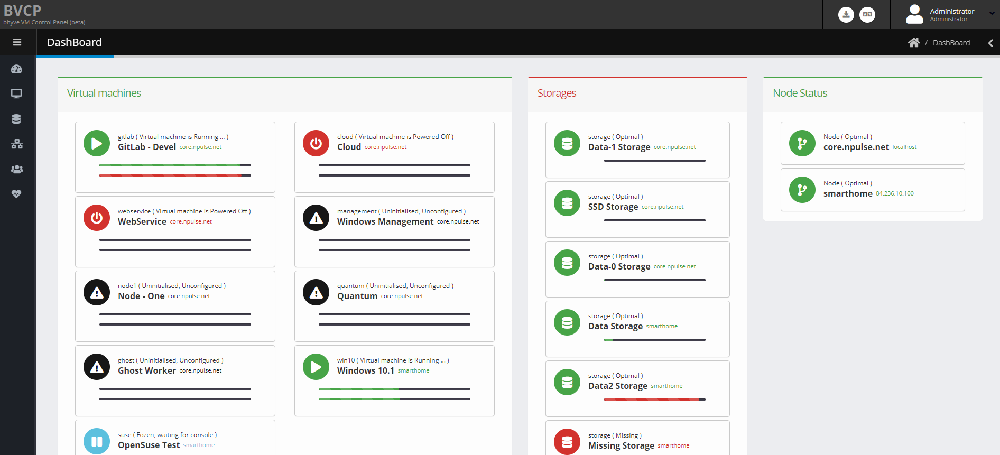

# BVCP Application (Bhyve Virtual-Machine Control Panel)

**Current Version: 2.2.x-Release**

## In Nutshell
BVCP is a graphical and secure web control panel designed for managing FreeBSD bhyve virtual machines.
Engineered for datacenter-grade reliability, BVCP is built for continuous 24/7 operation with a focus on stability and performance.
It is a native FreeBSD application featuring a simple one-click installation process, ensuring quick and effortless deployment.
BVCP operates independently of system configurations and does not modify existing settings, allowing it to run smoothly in most environments.
With BVCP, administrators can manage multiple physical hosts through a single unified interface—without the need for clustering.

## Introduction
This project is a personal initiative by Viktor Hlavaji (DaVieS), the creator of nPulse.net. With over a decade of experience in developing industry-class and enterprise-grade software, we brings deep expertise and a passion for sharing knowledge and resources.

The software offers a graphical user interface accessible via a web interface, complemented by a command-line interface (CLI) and a fully featured API. This design enables flexible, remote management of virtual machines through an intuitive web GUI and via custom solutions.

Built on the robust and proven Kinga Framework, which has powered various enterprise-class products since 2017, the software is primarily developed in C and C++ to ensure high performance and reliability.


The architecture is modular and consists of the following key components:
- Frontend (non privileged web interface) for user interaction
- Backend (Worker) handling core operational tasks with elevated privileges
- Helper is handling the virtual machine launch tasks
- This structure supports scalability, maintainability, and efficient operation in production environments.


Please refer to the website for more informations: [bhyve.npulse.net](https://bhyve.npulse.net)

## ScreenShots
 
 
 

## Bhyve
The software requires an environment running FreeBSD 13.4-RELEASE or newer with the bhyve hypervisor enabled to function correctly. The underlying FreeBSD system and hardware must meet these specifications for full compatibility and optimal operation with this project.

## License: Community Free-Of-Charge Edition
- You can download, install and use the BVCP Application for without any charges and limitations including commercial.
- You can not modify the binaries, disassemble the binaries, resell the software, redistribute the software, etc..
- You are allowed to upload screenshots and videos from the application itself in purpose of documentation, tutorial, HOWTOs
- Please refer to the LICENSE for more informations.

## Installation
### Minimum Requirements
- At least a FreeBSD 13.4-RELEASE or newer installed onto your target machine with virtualisation capable amd64 architecture.
- Minimum 250MB of free space on /var/lib for the binaries
- Network interface

#### 1) Log in to your FreeBSD Box and bring-up a root shell
    root@vmhost:~ #

#### 2) Download the latest release
  `fetch https://bhyve.npulse.net/release.tgz` or download manually from (this) github page

#### 3) Extract the archive you have downloaded
  `tar -xzvf release.tgz`
````
  x bhyve-webadmin/
  x bhyve-webadmin/utils/
  x bhyve-webadmin/API/
  x bhyve-webadmin/install.sh
  x bhyve-webadmin/Frontend/
  x bhyve-webadmin/.git/
  x bhyve-webadmin/Backend/
  x bhyve-webadmin/update.sh
  x bhyve-webadmin/Helper/
  x bhyve-webadmin/Helper/vmctl
  ...
````

#### 4) Enter `bhyve-webadmin` and run `install.sh`
  root@vmhost:~# `cd bhyve-webadmin && ./install.sh`

````
  Installing BVCP into your FreeBSD Installation within seconds ...

  Press [CTRL] + [C] to Abort !
  ...

          ██████╗ ██╗   ██╗ ██████╗██████╗
          ██╔══██╗██║   ██║██╔════╝██╔══██╗
          ██████╔╝██║   ██║██║     ██████╔╝
          ██╔══██╗╚██╗ ██╔╝██║     ██╔═══╝
          ██████╔╝ ╚████╔╝ ╚██████╗██║
          ╚═════╝   ╚═══╝   ╚═════╝╚═╝

  Bhyve Virtual-Machine Control Panel under FreeBSD
  [N] 2021-06-26 22:16:56 | application/vmserver/main.c | Initialising bhyve VM Server Application

  (+) The Software is producing pseudo filesystem scheme for virtual machines using symlinks
  Where to create metadata, iso_images, database, config, logs: (Does not need much space), default: [/vms]_>
````
#### 5) Enter a path (default: /vms) where some misc data placed, but not for storing virtual disks!!
````
    ...
        (!) Admin Credentials recreated,
        - User: admin
        - Password: AXN3jtPt
            
    [N] 2021-06-26 22:28:00 | SW | Program exited gracefully...
    Installation Finished!
    Navigate: https://[your-ip]:8086
````

#### 6) Installation is should be done, please write down your initial credentials and try access at `https://[your-ip]:8086`
#### 7) Please log-in and manage your account settings, before creation of any VM, please ensure you have added Storage and Network for the VM.


## API Interface
### General
````

  ██████╗ ██╗   ██╗ ██████╗██████╗
  ██╔══██╗██║   ██║██╔════╝██╔══██╗
  ██████╔╝██║   ██║██║     ██████╔╝
  ██╔══██╗╚██╗ ██╔╝██║     ██╔═══╝
  ██████╔╝ ╚████╔╝ ╚██████╗██║
  ╚═════╝   ╚═══╝   ╚═════╝╚═╝

Bhyve Virtual-Machine Control Panel under FreeBSD

 Available Command Line Arguments:
  - /var/lib/nPulse/vmm setup           Initial Setup
  - /var/lib/nPulse/vmm resecure        Change API Keys
  - /var/lib/nPulse/vmm reset_password  Change Admin Credential
  - /var/lib/nPulse/vmm cli             CLI Interface

Available Commands:
+ vm      | Virtual Machine Management
+ storage | Storage Management
+ switch  | Virtual Switch Management
+ user    | Built-in User Management
+ vminfo  | SysInfo
+ version | Software Version
+ config  | Internal Storage and Global Commands

more details:  vm
cmd example:  vm list
Note: type exit to Quit

_>
````

### VM Submenu
````
  _> vm
  * [vm] Available Commands:
   [Start/Stop Commands]
   + start [prefix]                                                          | Start virtual machine
   + check [prefix]                                                          | Check virtual machine
   + stat  [prefix] {format: safe,raw}                                       | Get CPU/MEM statistics
   + shutdown [prefix]                                                       | ACPI Shutdown
   + user [user]                                                             | Add user to the VM
   + log [prefix] [max_entries]                                              | Fetch VM Journal
   + pause [prefix]                                                          | Pause virtual machine
   + resume [prefix]                                                         | Resume virtual machine
   + kill [prefix]                                                           | Kill virtual machine
   + stop [prefix]                                                           | Stop virtual machine
   + list {prefix}                                                           | List virtual machine
   + destroy {prefix}                                                        | Destroy virtual machine
   + restart [prefix]                                                        | Restart virtual machine

   [Management Commands]
   + create [prefix] [description]                                           | New virtual machine
   + desc [prefix] [new_description]                                         | Modify virtual machine
   + note [prefix] {new_note}                                                | Add/Get note
   + clear [prefix]                                                          | Clear config (debug purpose)
   + set [prefix] [key] [value]                                              | Set core variables
     - keys: cpu.socket, cpu.core, memory, sys[linux,win,bsd] arch[intel,amd]
     - keys: vnc.wait, vnc.display, utc_time, wire_memory, passthru, hda
     - keys: clear_bios [DEPRECATED]
     - keys: reset_uefi=[yes], protect_uefi=[true/false]
     - keys: auto_boot=[true/false], boot_priority=[low/med/high]
     - keys: custom_prepend                                                  | Prepend custom parameters
     - keys: custom_append                                                   | Append custom parameters
   - destroy [prefix]                                                        | Destroy virtual machine

   [Disk Management Commands]
   + disk create [prefix] [storage] [name] [size]                            | Create new disk
   + disk attach [prefix] [file] [desc] [slot] [legacy/ahci/virtio/nvme]     | Attach Disk into VM
   + disk nvme_set [prefix] [name] [key] [value]                             | Set nvme values on disk
     - keys: maxq (Max number of queues), qsz (Queue Size), isoslots (IO Slots), sectsz (Sector Size in Bytes)
   + disk detach [prefix] [file]                                             | Detach Disk from VM
   + disk destroy [prefix] [ID/file]                                         | Delete Disk
   + disk resize [prefix] [file] [new_size]                                  | Resize Disk
   + disk list [prefix]                                                      | List Disks

   [Share Management Commands]
   + share attach [prefix] [share_name] [host_dir] {readonly}                | Create Virtio-9P VirtFS
   + share detach [prefix] [share_name]                                      | Remove Share
   + share list [prefix]                                                     | List Shares

   [CDROM Commands]
   + cdrom attach [prefix] [iso_file]                                        | Attach ISO file as CD-ROM
   + cdrom detach [prefix] [iso_file]                                        | Detach ISO
   + cdrom list [prefix]                                                     | List ISO Images

   [Network Commands]
   + nic add_virtio [prefix] [switch] {mac_addr} {host_ip} {custom_route}    | Add VirtIO/NIC bound to switch
   + nic add_legacy [prefix] [switch] {mac_addr} {host_ip} {custom_route}    | Add Intel/NIC bound to switch
   + nic change [prefix] [NIC] [switch]                                      | Change Switch
   + nic mac [prefix] [NIC] [mac_addr]                                       | Change MAC Address
   + nic host_ip [prefix] [NIC] [ip]                                         | Add IP to host's TAP interface
   + nic custom_route [prefix] [NIC] [ip]                                    | Add custom route rule to host's TAP interface
   + nic enable [prefix] [NIC]                                               | Enable NIC
   + nic disable [prefix] [NIC]                                              | Disable NIC
   + nic remove [prefix] [NIC]                                               | Remove NIC
   + nic list [prefix]                                                       | List Interfaces
````

### Storage Submenu
````
  _> storage
  * [storage] Available Commands:
   [Basic Commands]
   + list {active}                               | List Storages
   + info [mountpoint]                           | Get usage statistics
   + create [mountpoint] [description]           | Enable new storage
   + modify [mountpoint] [desc] {enable/disable} | Modify existing storage
   + empty_trash [mountpoint]                    | Empty deleted disk images
   + destroy [mountpoint]                        | Destroy Storage
````

### Switch Submenu
````
  _> switch
  * [switch] Available Commands:
   [Basic Commands]
   + create [prefix] [description]                                                       | Create new vSwitch
   + destroy [prefix]                                                                    | Destroy vSwitch
   + desc [prefix] [description]                                                         | Rename vSwitch
   + reload                                                                              | Reload Configuration
   + cleanup                                                                             | Clear OS configuration
   + bound [prefix] [iface]                                                              | Bound to network interface
   + unbound [prefix]                                                                    | UnBound from network interface
   + list                                                                                | List vSwitch
   + listDevs                                                                            | List Network Cards
````

### Switch Submenu
````
  _> user
   * [user] Available Commands:
   + ipinfo [ip_addr] {async}                                          | Show IP Geo Info
   + fetch [userID/mail/ALL]                                           | Get list of user(s)
   + logauth [mail] [TYPE] [IP] [CUID] [EXT]                           | Log Authentication
   + authlog [mail/ALL]                                                | Retrieve Authentication Logs
   + change [mail/ID] [new_name] [new_mail] [new_password (optional)]  | Modify User Settings
   + role [mail/ID] [USER/ADMIN]                                       | Modify User Role
   + create [name] [mail] [passwd]                                     | Create new user account
   + delete [mail/userID]                                              | Delete user account
````

### Config Submenu
````
 _> config
   * [config] Available Commands:
   [Basic Commands]
   + set [key] [value]   | Set config variable
   + get [key]           | Get config variable
   + del [key]           | Delete config variable

   [Global Commands]
   + abort_autoboot      | Abort autoboot process
````
